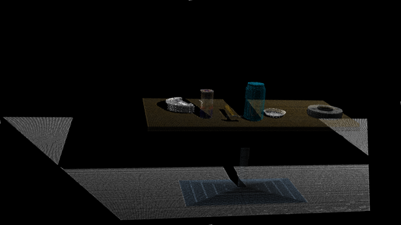
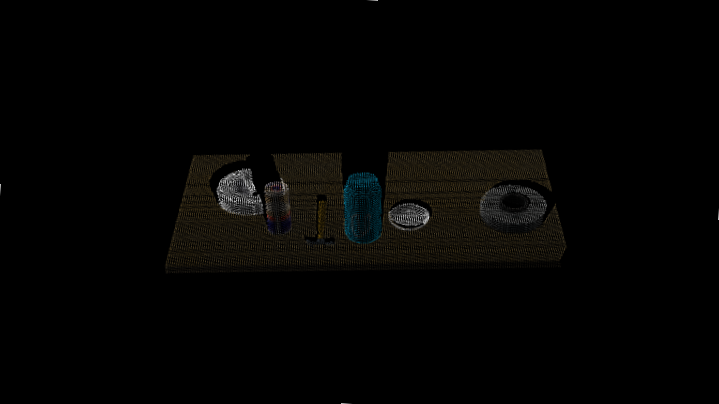
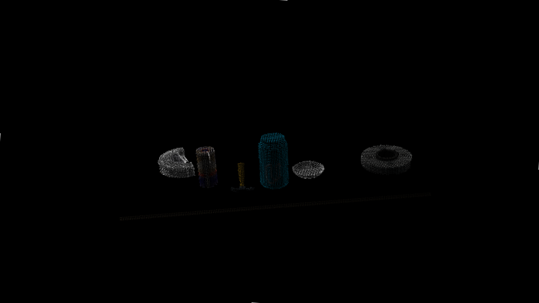
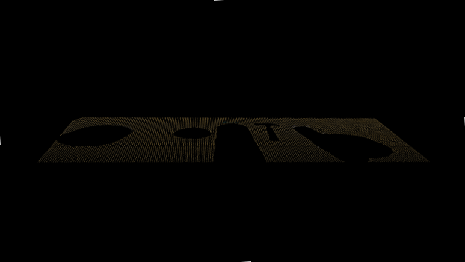
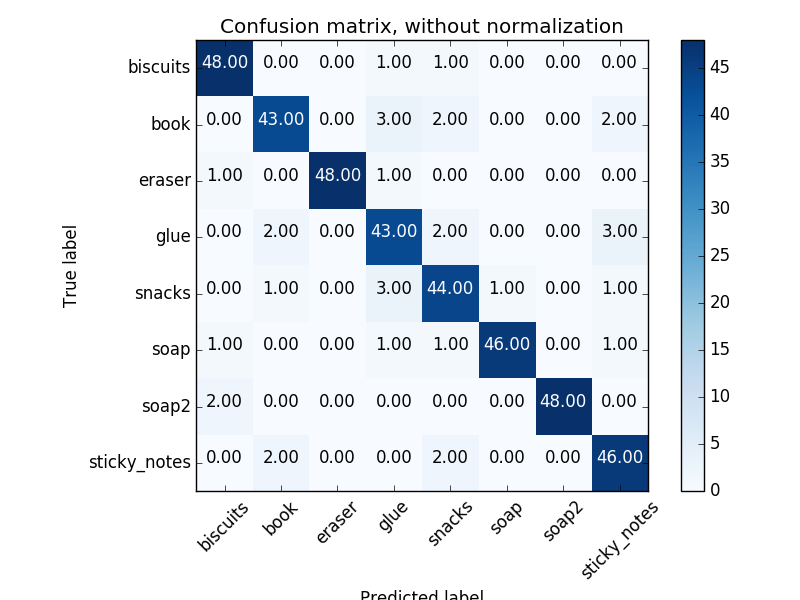
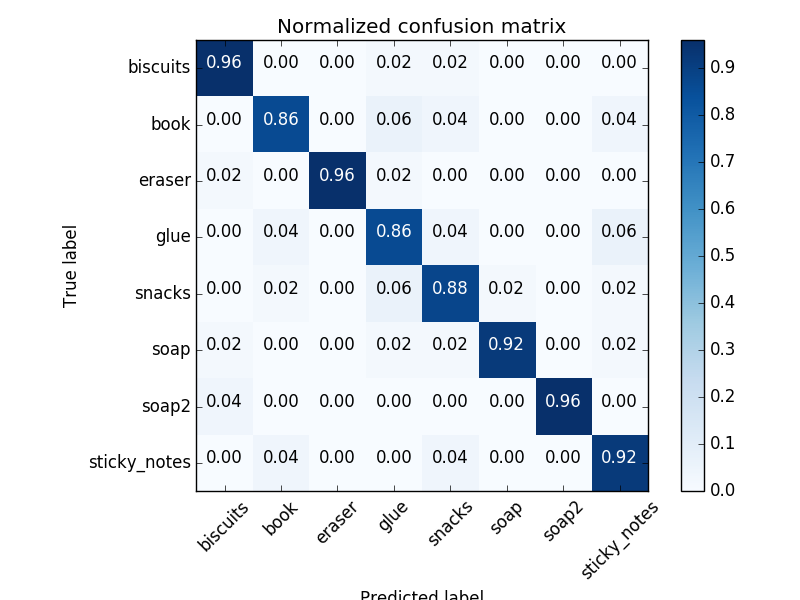

# Project: Perception Pick & Place

​    This project uses a PR2 robot for object recognition using point cloud data. The raw point cloud data is processed to get segmented objects in the 3D space. After training SVM (Support Vector Machine) model on point cloud data features and RGB data features, object recognition is done.

### PR2 Robot

## [Rubric](https://review.udacity.com/#!/rubrics/1067/view) Points
Rubrics cover the following:

- Writeup
- Exercise 1, 2 and 3 pipeline implemented
- Pick and Place Setup

---
### Writeup / README

#### 1. Provide a Writeup / README that includes all the rubric points and how you addressed each one.  You can submit your writeup as markdown or pdf.  

You're reading it!

---

### Exercise 1, 2 and 3 pipeline implemented

​    The code can be found in `project.py` located at `~/catkin_ws/src/RoboND-Perception-Project/pr2_robot/scripts/`

#### 1. Complete Exercise 1 steps. Pipeline for filtering and RANSAC plane fitting implemented.

- Following is the point cloud data coming form the RGBD camera

- The data consists of dense points which contains X,Y,Z,R,G,B information.
- To reduce the computation, we implement Voxel downsampling
- Voxel is similar to Pixel but for Point Cloud Data

- After downsampling, we need to remove the unnecessary data. This is done by using Passthrough filter

- Later, RANSAC plane segmentation is performed to get the point cloud data on objects. The remaining point cloud data is the table after segmenting the objects

  

  

#### 2. Complete Exercise 2 steps: Pipeline including clustering for segmentation implemented.  

- Now that we have segmented objects from the table, we need to segment the different objects.
- We have used a Euclidean Clustering to segment out objects.
- Different objects are segmented based on the distance of point clouds in a cluster

#### 2. Complete Exercise 3 Steps.  Features extracted and SVM trained.  Object recognition implemented.

- Now that we have segmented objects, we need to classify these objects.
- Support Vector Machine(SVM) is a machine learning algorithm which uses data features to learn to classify an object.
- We have used **color histogram** and **surface normal** as the features to learn about the objects
- Using these features, SVM model is trained to recognize the objects
- Following is the confusion matrix of training for the World_3

- After training the model, we used it to test it on the RGBD camera data

- The detection for other set of arrangement of objects:

- In this way, the perception pipeline is implemented to recognize the objects and the distance of the objects.

---

### Pick and Place Setup

#### 1. For all three tabletop setups (`test*.world`), perform object recognition, then read in respective pick list (`pick_list_*.yaml`). Next construct the messages that would comprise a valid `PickPlace` request output them to `.yaml` format.

- Now, our robot can recognize objects and knows at what distances objects are. We will pass object name and calculate the values of the actuations, robot has to perform in order to pick and place the object.
- While testing, same world is selected for including objects as well as passing the list 
- Depending upon the sequence and box in which the object should be sorted, the dropping location of each object is calculated 
- `output_1.yaml`: Contains drop location of 3 objects in the world-1
- `output_2.yaml`: Contains drop location of 5 objects in the world-2
- `output_3.yaml`: Contains drop location of 7 objects in the world-3
- These locations are used to design the trajectory of the arms of PR2 robot.

---

